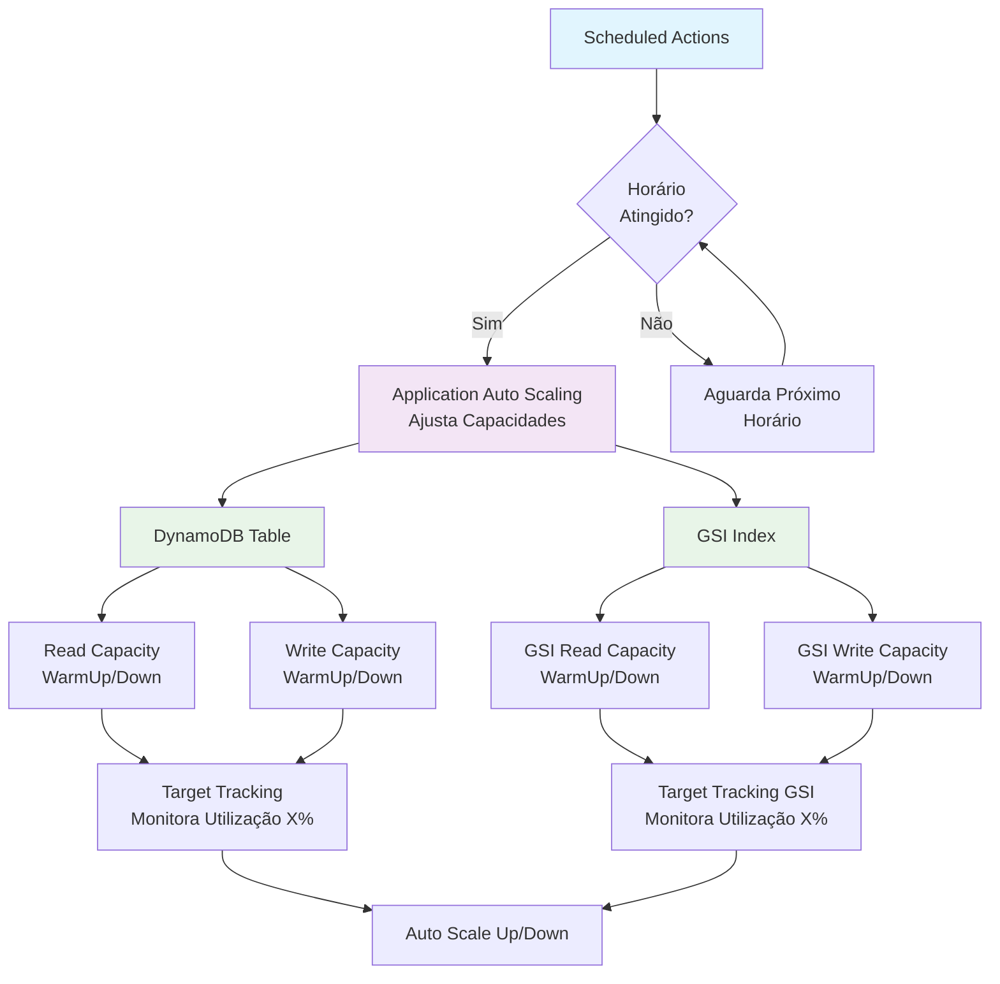

# DynamoDB Scheduled Auto Scaling - Terraform

Este projeto implementa uma solução completa de **autoscaling agendado** para tabelas DynamoDB usando Application Auto Scaling da AWS. 

O objetivo é ilustrar como configurar warm-up automático baseado em horários específicos tanto para a tabela principal quanto para Global Secondary Indexes (GSI) para suprir capacity repentinos em picos de acesso conhecidos.

<!-- BEGIN_TF_DOCS -->
## Requirements

| Name | Version |
|------|---------|
|  [terraform](#requirement\_terraform) | >= 1.0 |
|  [aws](#requirement\_aws) | ~> 5.0 |

## Providers

| Name | Version |
|------|---------|
|  [aws](#provider\_aws) | 5.100.0 |

## Modules

No modules.

## Resources

| Name | Type |
|------|------|
| [aws_appautoscaling_policy.gsi_read_policy](https://registry.terraform.io/providers/hashicorp/aws/latest/docs/resources/appautoscaling_policy) | resource |
| [aws_appautoscaling_policy.gsi_write_policy](https://registry.terraform.io/providers/hashicorp/aws/latest/docs/resources/appautoscaling_policy) | resource |
| [aws_appautoscaling_policy.table_read_policy](https://registry.terraform.io/providers/hashicorp/aws/latest/docs/resources/appautoscaling_policy) | resource |
| [aws_appautoscaling_policy.table_write_policy](https://registry.terraform.io/providers/hashicorp/aws/latest/docs/resources/appautoscaling_policy) | resource |
| [aws_appautoscaling_scheduled_action.gsi_read_scheduled](https://registry.terraform.io/providers/hashicorp/aws/latest/docs/resources/appautoscaling_scheduled_action) | resource |
| [aws_appautoscaling_scheduled_action.gsi_write_scheduled](https://registry.terraform.io/providers/hashicorp/aws/latest/docs/resources/appautoscaling_scheduled_action) | resource |
| [aws_appautoscaling_scheduled_action.table_read_scheduled](https://registry.terraform.io/providers/hashicorp/aws/latest/docs/resources/appautoscaling_scheduled_action) | resource |
| [aws_appautoscaling_scheduled_action.table_write_scheduled](https://registry.terraform.io/providers/hashicorp/aws/latest/docs/resources/appautoscaling_scheduled_action) | resource |
| [aws_appautoscaling_target.gsi_read_target](https://registry.terraform.io/providers/hashicorp/aws/latest/docs/resources/appautoscaling_target) | resource |
| [aws_appautoscaling_target.gsi_write_target](https://registry.terraform.io/providers/hashicorp/aws/latest/docs/resources/appautoscaling_target) | resource |
| [aws_appautoscaling_target.table_read_target](https://registry.terraform.io/providers/hashicorp/aws/latest/docs/resources/appautoscaling_target) | resource |
| [aws_appautoscaling_target.table_write_target](https://registry.terraform.io/providers/hashicorp/aws/latest/docs/resources/appautoscaling_target) | resource |
| [aws_dynamodb_table.exemplo_tabela](https://registry.terraform.io/providers/hashicorp/aws/latest/docs/resources/dynamodb_table) | resource |
| [aws_iam_role.dynamodb_autoscaling_role](https://registry.terraform.io/providers/hashicorp/aws/latest/docs/resources/iam_role) | resource |
| [aws_iam_role_policy.dynamodb_autoscaling_policy](https://registry.terraform.io/providers/hashicorp/aws/latest/docs/resources/iam_role_policy) | resource |

## Inputs

| Name | Description | Type | Default | Required |
|------|-------------|------|---------|:--------:|
|  [aws\_region](#input\_aws\_region) | n/a | `string` | `"us-east-1"` | no |
|  [enable\_ttl](#input\_enable\_ttl) | n/a | `bool` | `true` | no |
|  [read\_capacity](#input\_read\_capacity) | n/a | `number` | `5` | no |
|  [read\_capacity\_max](#input\_read\_capacity\_max) | n/a | `number` | `50` | no |
|  [scheduled\_actions\_gsi](#input\_scheduled\_actions\_gsi) | Lista de ações agendadas para warm-up/scale do GSI | <pre>list(object({     name     = string     rcu_min  = number     rcu_max  = number     wcu_min  = number     wcu_max  = number     cron     = string     timezone = string   }))</pre> | <pre>[   {     "cron": "cron(07 17 * * ? *)",     "name": "peak test warmup",     "rcu_max": 30,     "rcu_min": 20,     "timezone": "America/Sao_Paulo",     "wcu_max": 30,     "wcu_min": 20   },   {     "cron": "cron(30 15 * * ? *)",     "name": "peak test warmdown",     "rcu_max": 10,     "rcu_min": 5,     "timezone": "America/Sao_Paulo",     "wcu_max": 10,     "wcu_min": 5   } ]</pre> | no |
|  [scheduled\_actions\_table](#input\_scheduled\_actions\_table) | Lista de ações agendadas para warm-up/scale da tabela DynamoDB | <pre>list(object({     name     = string     rcu_min  = number     rcu_max  = number     wcu_min  = number     wcu_max  = number     cron     = string     timezone = string   }))</pre> | <pre>[   {     "cron": "cron(58 14 * * ? *)",     "name": "peak test warmup",     "rcu_max": 30,     "rcu_min": 20,     "timezone": "America/Sao_Paulo",     "wcu_max": 30,     "wcu_min": 20   },   {     "cron": "cron(30 15 * * ? *)",     "name": "peak test warmdown",     "rcu_max": 10,     "rcu_min": 5,     "timezone": "America/Sao_Paulo",     "wcu_max": 10,     "wcu_min": 5   } ]</pre> | no |
|  [table\_name](#input\_table\_name) | n/a | `string` | `"example-autoscaling"` | no |
|  [tags](#input\_tags) | n/a | `map(string)` | `{}` | no |
|  [write\_capacity](#input\_write\_capacity) | n/a | `number` | `5` | no |
|  [write\_capacity\_max](#input\_write\_capacity\_max) | n/a | `number` | `50` | no |

## Outputs

No outputs.
<!-- END_TF_DOCS -->